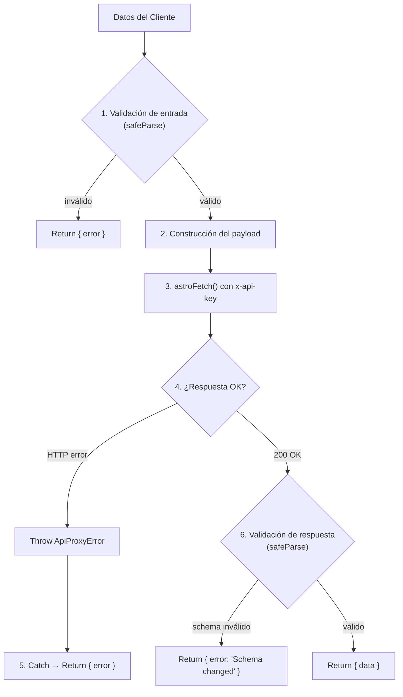
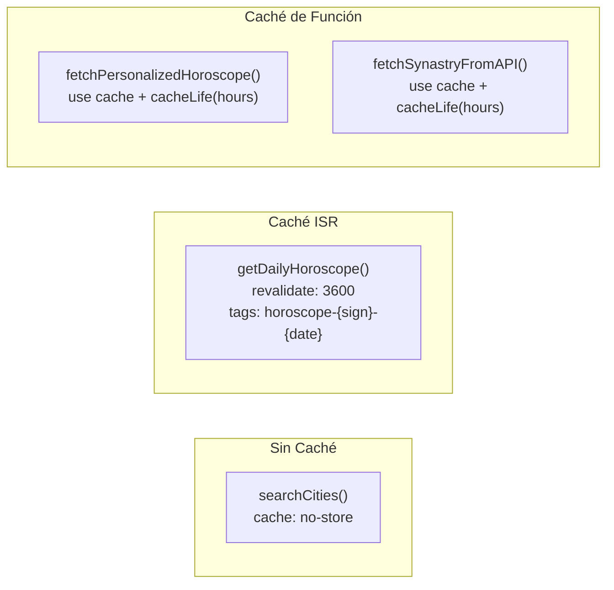

# Integración con API Externa — Mystik

## Proveedor

**FreeAstroAPI** — Servicio de astrología computacional que proporciona horóscopos diarios, lecturas personalizadas basadas en tránsitos y cálculos de sinastría.

- **URL Base:** `$FREEASTROAPI_BASE_URL` (variable de entorno)
- **Autenticación:** Header `x-api-key` con valor de `$FREEASTROAPI_API_KEY`
- **Formato:** JSON (request y response)
- **Timeout por defecto:** 15.000 ms

## Contrato de Endpoints

### 1. Horóscopo Diario por Signo

| Propiedad | Valor |
|---|---|
| **Método** | `GET` |
| **Ruta** | `/api/v2/horoscope/daily/sign` |
| **Query Params** | `sign` (string, slug del signo), `date` (string, `YYYY-MM-DD` o `"today"`) |
| **Caché** | ISR: `revalidate: 3600` con tags `horoscope-{sign}-{date}` |
| **Server Action** | `getDailyHoroscope(sign, date)` |
| **Schema de respuesta** | `horoscopeApiResponseSchema` |

**Ejemplo de petición:**
```
GET /api/v2/horoscope/daily/sign?sign=aries&date=today
x-api-key: <API_KEY>
```

### 2. Horóscopo Personalizado

| Propiedad | Valor |
|---|---|
| **Método** | `POST` |
| **Ruta** | `/api/v2/horoscope/daily/personal` |
| **Body** | `{ birth: { year, month, day, hour, minute, latitude, longitude, city? }, date }` |
| **Caché** | `"use cache"` + `cacheLife("hours")` |
| **Server Action** | `getPersonalizedHoroscope(birth)` |
| **Schema de respuesta** | `horoscopeApiResponseSchema` |

**Ejemplo de body:**
```json
{
  "birth": {
    "year": 1995,
    "month": 6,
    "day": 15,
    "hour": 14,
    "minute": 30,
    "latitude": 4.6097,
    "longitude": -74.0817,
    "city": "Bogotá"
  },
  "date": "2026-04-15"
}
```

### 3. Cálculo de Sinastría

| Propiedad | Valor |
|---|---|
| **Método** | `POST` |
| **Ruta** | `/api/v1/western/synastrycards` |
| **Body** | `{ person_a: SynastryPersonInput, person_b: SynastryPersonInput }` |
| **Caché** | `"use cache"` + `cacheLife("hours")` |
| **Server Action** | `calculateSynastry(payload)` |
| **Schema de payload** | `synastryApiPayloadSchema` |
| **Schema de respuesta** | `synastryApiResponseSchema` |

**Ejemplo de body:**
```json
{
  "person_a": {
    "name": "Persona A",
    "datetime": "1995-06-15T14:30:00",
    "tz_str": "America/Bogota",
    "location": { "city": "Bogotá", "lat": 4.6097, "lng": -74.0817 }
  },
  "person_b": {
    "name": "Persona B",
    "datetime": "1998-03-22T09:15:00",
    "tz_str": "America/Bogota",
    "location": { "city": "Medellín", "lat": 6.2442, "lng": -75.5812 }
  }
}
```

### 4. Búsqueda de Ciudades (Geocodificación)

| Propiedad | Valor |
|---|---|
| **Método** | `GET` |
| **Ruta** | `/api/v1/geo/search` |
| **Query Params** | `q` (string, término de búsqueda), `limit` (number, máximo de resultados) |
| **Caché** | `cache: "no-store"` (sin caché) |
| **Timeout** | 30.000 ms (extendido) |
| **Server Action** | `searchCities(query)` |
| **Schema de respuesta** | `geoSearchResponseSchema` |

## Capa de Seguridad: Server Actions como Proxy

Las Server Actions no son simples "pass-through" hacia la API. Actúan como una **capa de seguridad y normalización** con las siguientes responsabilidades:



### Protecciones implementadas:

1. **Credenciales ocultas:** `client.ts` importa `"server-only"`, impidiendo que el API key llegue al bundle del navegador.
2. **Validación de entrada:** `safeParse` en cada Server Action antes de hacer la petición HTTP.
3. **Validación de salida:** La respuesta de la API se valida contra esquemas Zod tipados.
4. **Timeout con AbortSignal:** Todas las peticiones tienen un timeout máximo con `AbortSignal.timeout()`.
5. **Errores normalizados:** Todos los errores se mapean a un formato uniforme `{ error: string }`.

## Mapeo de Errores

### Errores del Proxy (`ApiProxyError`)

| Condición | Código HTTP | Código Interno | Mensaje |
|---|---|---|---|
| API Key no configurada | 500 | `MISSING_API_KEY` | "FREEASTROAPI_API_KEY is not configured" |
| Timeout de la petición | 504 | `UPSTREAM_TIMEOUT` | Mensaje del error original |
| Error de red | 502 | `UPSTREAM_NETWORK_ERROR` | Mensaje del error original |
| Respuesta HTTP ≠ 2xx | Status original | `UPSTREAM_{status}` | "FreeAstroAPI responded with {status}" |

### Formato de Error para el Cliente

Todas las Server Actions retornan un **union type discriminado**:

```typescript
// Éxito
{ data: T, error?: never }

// Error
{ data?: never, error: string }
```

Este patrón permite al cliente hacer pattern matching simple:

```typescript
const result = await getDailyHoroscope("aries")
if (result.error) {
  // Manejar error — string legible por el usuario
} else {
  // Usar result.data — completamente tipado
}
```

### Flujo de Errores completo

```
API HTTP 429 (Rate Limit)
  → astroFetch() lanza ApiProxyError(429, "UPSTREAM_429", ...)
    → Server Action catch → return { error: "We couldn't load..." }
      → Componente React muestra <ErrorState message={error} />
```

Los mensajes de error que llegan al usuario son **genéricos y amigables**, nunca exponen detalles internos de la API o stack traces.

## Caché y Revalidación



**Decisiones de diseño:**
- **Horóscopo diario:** Se cachea por 1 hora con tags porque el contenido cambia diariamente, y múltiples usuarios piden el mismo signo.
- **Personalizado/Sinastría:** Se cachea a nivel de función porque los mismos inputs de nacimiento generan el mismo resultado.
- **Geocodificación:** No se cachea porque las búsquedas son de alta variabilidad y se necesita frescura en los resultados.
