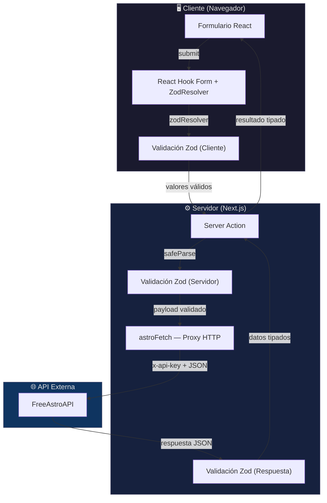
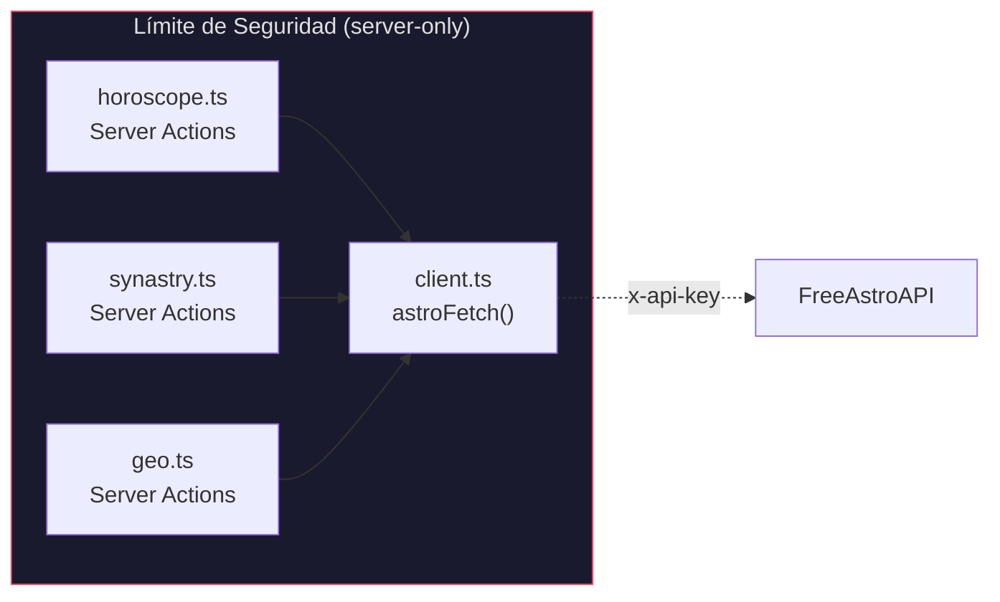
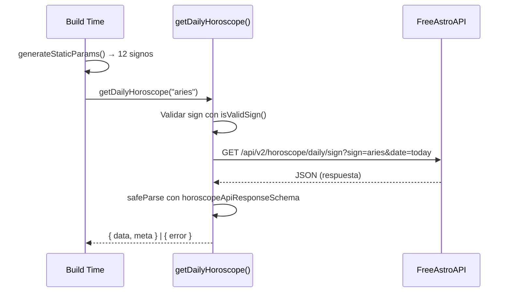
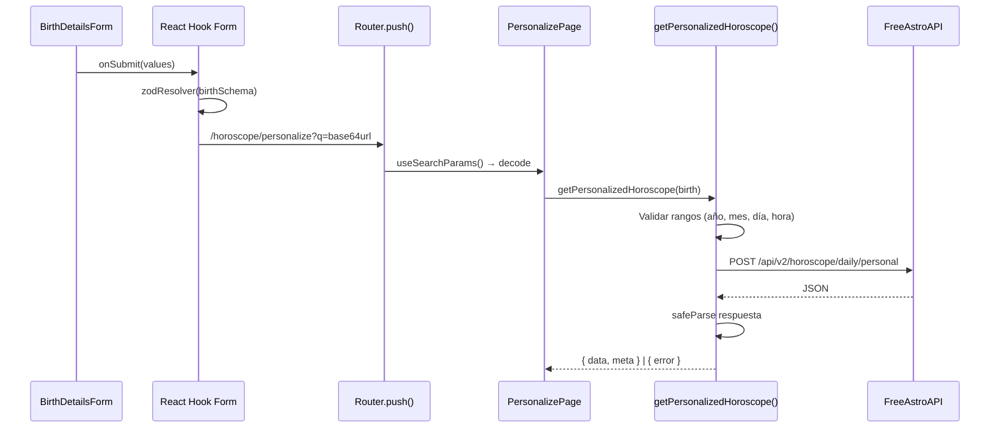
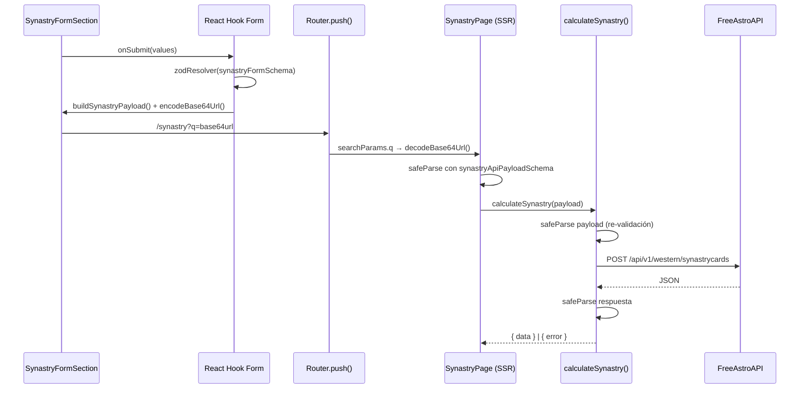

# Arquitectura — Mystik

## Visión General

Mystik sigue una arquitectura **unidireccional** basada en el App Router de Next.js 16, donde los datos fluyen desde formularios del cliente hasta una API externa pasando por dos capas de validación independientes. El servidor actúa como un proxy seguro que nunca expone credenciales al navegador.

## Diagrama de Flujo de Datos



## Validación en Dos Capas

La arquitectura implementa un modelo de **doble validación** que garantiza integridad de datos independientemente de cómo se invoque la función:

### Capa 1 — Cliente (React Hook Form + Zod)

Los formularios utilizan `useForm` con `zodResolver` para validar datos **antes** de enviarlos al servidor. Esta capa proporciona retroalimentación inmediata al usuario.

```
useForm<SynastryFormValues>({
  resolver: zodResolver(synastryFormSchema)
})
```

**Responsabilidades:**
- Validación de formato (fechas, horas, strings no vacíos)
- Verificación de campos requeridos (ej. ubicación seleccionada)
- Feedback visual instantáneo en los campos del formulario

### Capa 2 — Servidor (Server Actions + Zod)

Las Server Actions (`"use server"`) re-validan **todo el payload** con `safeParse` antes de hacer la petición HTTP. Esta capa es la **barrera de seguridad real**, ya que la validación del cliente puede ser evadida.

```
const validation = synastryApiPayloadSchema.safeParse(payload)
if (!validation.success) {
  return { error: "Invalid payload" }
}
```

**Responsabilidades:**
- Re-validación completa del payload (nunca confiar en el cliente)
- Validación de rangos de negocio (ej. año de nacimiento ≥ 1900)
- Validación de la respuesta de la API contra esquemas Zod
- Transformación de errores a un formato consumible por el cliente

### Capa 3 — Validación de Respuesta

Los datos devueltos por la API externa también son validados contra esquemas Zod antes de ser utilizados. Esto protege contra cambios no anunciados en el contrato de la API.

```
const parsed = horoscopeApiResponseSchema.safeParse(raw)
if (!parsed.success) {
  return { error: "The API schema has changed." }
}
```

## Patrón de Proxy Seguro (`lib/astro-api/`)



El módulo `client.ts` importa `"server-only"` para garantizar a nivel de bundler que **nunca** se incluya en el JavaScript del cliente. Esto asegura que:

- La `FREEASTROAPI_API_KEY` nunca se expone al navegador
- La `FREEASTROAPI_BASE_URL` permanece privada
- Todas las peticiones a la API externa pasan por el servidor de Next.js

## Estrategia de Caché

| Módulo | Estrategia | TTL | Mecanismo |
|---|---|---|---|
| `getDailyHoroscope()` | ISR con tags | 1 hora | `next: { revalidate: 3600, tags: [...] }` |
| `fetchPersonalizedHoroscope()` | Caché de función | Horas | `"use cache"` + `cacheLife("hours")` |
| `fetchSynastryFromAPI()` | Caché de función | Horas | `"use cache"` + `cacheLife("hours")` |
| `searchCities()` | Sin caché | — | `cache: "no-store"` |

La búsqueda de ciudades no se cachea intencionalmente porque los resultados deben reflejar el input exacto del usuario en tiempo real.

## Flujo de Datos por Vista

### `/horoscope/[sign]` — Horóscopo Diario (SSG)



### `/horoscope/personalize` — Lectura Personalizada (Cliente)



### `/synastry` — Reporte de Sinastría



## Separación Server / Client

| Directiva | Archivos | Propósito |
|---|---|---|
| `"server-only"` (import) | `lib/astro-api/client.ts` | Impedir inclusión en el bundle del cliente |
| `"use server"` | `lib/astro-api/horoscope.ts`, `synastry.ts`, `geo.ts` | Marcar funciones como Server Actions invocables desde el cliente |
| `"use cache"` | Funciones internas (`fetchPersonalizedHoroscope`, `fetchSynastryFromAPI`) | Habilitar caché a nivel de función |
| `"use client"` | Formularios, hooks, componentes interactivos | Habilitar interactividad en el navegador |
